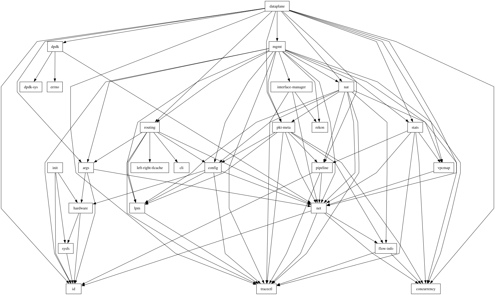

# Hedgehog Dataplane

[](https://app.fossa.com/projects/custom%2B43661%2Fgithub.com%2Fgithedgehog%2Fdataplane?ref=badge_shield)

This repository contains the Dataplane for [Hedgehog's Open Network Fabric][fabric-docs].
This component acts as a gateway between different VPCs managed by the Fabric, or to communicate with endpoints outside
of the Fabric.

[fabric-docs]: https://docs.githedgehog.com

## Build instructions

### Prerequisites

- A recent `x86_64` linux machine is required for development
- [Nix][nix] (the nix-shell provides the full toolchain, including Rust, Cargo, and all required libraries).
  The single-user installation is recommended unless you are familiar with nix and prefer the multi-user installation;
  both will work.
- [just][just] (task runner — install through your package manager or `nix-env -i just`)

[nix]: https://nixos.org/download/#nix-install-linux
[just]: https://github.com/casey/just

> [!NOTE]
> Ensure flakes are enabled
> (e.g. `experimental-features = nix-command flakes` in `~/.config/nix/nix.conf` for single-user installs,
> or `/etc/nix/nix.conf` for multi-user installs), or some commands will fail.

### Step 0. Clone the repository

```bash
git clone git@github.com:githedgehog/dataplane.git
cd dataplane
```

### Step 1. Enter the nix-shell

From the source directory, enter the development shell:

```bash
just shell
```

This provides the full development toolchain, including Rust, Cargo, Clippy, `cargo-nextest`, and all required
libraries and system dependencies.

### Step 2. Build the project

To build the dataplane with default settings

```bash
just build
```

is sufficient.

If you wish to build a specific package from this workspace, such as the init system or the cli

```bash
just build workspace.init
just build workspace.cli
```

Most just recipes are impacted by the `profile` argument which selects the cargo profile to use.
For instance, to build in release mode

```bash
just profile=release build
```

You can also select a target platform via the `platform` argument.
The default is `x86-64-v3`.

```bash
just platform=zen4 build
```

### Step 3. Run the tests

To run the full test suite

```bash
just test
```

To run tests in release mode

```bash
just profile=release test
```

You can enable a comma separated list of sanitizers via the `sanitize` argument.
You don't strictly need to use the fuzz profile with the sanitizers, but it is recommended.

```bash
just sanitize=address,leak profile=fuzz test
just sanitize=safe-stack profile=fuzz test
just sanitize=thread profile=fuzz test
```

You can also build and run the tests for a specific package from within this workspace.
For example, to run the `dataplane-net` package's tests

```bash
just test net
```

This covers basic testing and building of dataplane, but [there is more to testing dataplane](./testing.md).

### Step 4. Build container images

Note that running `just build dataplane` only builds the binary, not the container.
To build the dataplane container

```bash
just build-container dataplane
```

Or, if you wish to build in release mode

```bash
just profile=release build-container dataplane
```

You can build the FRR container as well

```bash
just build-container frr.dataplane
```

Sanitizers work with the container builds too

```bash
just sanitize=address,leak profile=fuzz build-container dataplane
just sanitize=address,leak profile=fuzz build-container frr.dataplane
just sanitize=thread profile=fuzz build-container dataplane
just sanitize=thread profile=fuzz build-container frr.dataplane
```

### Step 5. Push container images

To build and push a container image to the configured OCI registry

```bash
just push-container dataplane
just push-container frr.dataplane
```

By default, images are pushed to `127.0.0.1:30000`.
You can override this with the `oci_repo` argument

```bash
just oci_repo=my-registry.example.com:5000 push-container dataplane
```

## Packet drivers

The dataplane can move packets in more than one way, selected with `--driver`:

| Driver   | Notes                                                                 |
| -------- | --------------------------------------------------------------------- |
| `af-xdp` | The default. `AF_XDP` sockets; no copy where the NIC driver allows it |
| `kernel` | `AF_PACKET` sockets; works anywhere, copies every frame               |
| `dpdk`   | Not wired up yet                                                      |

### AF_XDP

`AF_XDP` is what the dataplane uses when it is not told otherwise, so nothing
has to be passed to get it:

```bash
dataplane --interface eth0=kernel@eth0 --interface eth1=kernel@eth1
```

The process needs `CAP_NET_RAW` to open the sockets and `CAP_BPF` to load the
XDP program that decides where packets go. Where it cannot be given those, pass
`--driver kernel` instead.

The driver runs one worker per RX queue, each with a socket on every interface.
Zero-copy is tried first on every one of them and copy mode used where the NIC
driver will not do it, which the log says at startup.

The kernel will not register a UMEM whose chunks are larger than a page, so a
packet above about 3.8KB does not fit in one and is carried in several. Those
are gathered into one buffer on the way in and split again on the way out,
which costs a copy each way; everything smaller is untouched. Without it a
jumbo MTU would not work at all -- the kernel refuses to attach an XDP program
that does not declare it to an interface whose MTU exceeds a buffer, and drops
what will not fit.

### What the host still receives

Redirecting a packet to an `AF_XDP` socket is final: the network stack never
sees it. If everything on an interface were redirected, anything running on the
host -- routing sessions, neighbour discovery -- would stop receiving, and
nothing in userspace can put a packet back on an interface's receive path.

So the XDP program in `xdp-ebpf/` decides. It passes to the kernel what is not
IP, what is addressed to one of the host's own addresses -- which the driver
keeps it told about as they are configured and removed -- and link-local
multicast, which is how neighbours address each other: `ND`, router
advertisements, OSPF, VRRP. VXLAN is the exception: it arrives addressed to the
gateway too, and it is what the dataplane is for. Everything else goes to the
dataplane.

Packets the pipeline asks to be delivered locally are counted as `to-kernel` in
`show driver status`. That number should stay at zero; anything else is traffic
the XDP program redirected to us that the host was expecting.

### Building

The build compiles libxdp from source, along with the libbpf it bundles, and
builds the XDP program for the BPF target with bpf-linker. The nix shell and
the packaged build provide both; `just build-ebpf` rebuilds the program alone
when iterating on it.

`--no-default-features` leaves the driver out altogether, for a build without
the toolchain, and such a build has to be told to use the kernel driver.

## Common build arguments

Most just recipes accept the following arguments, which can be combined freely:

| Argument     | Default     | Description                                                                           |
| ------------ | ----------- | ------------------------------------------------------------------------------------- |
| `profile`    | `debug`     | Cargo build profile (`debug`, `release`, or `fuzz`)                                   |
| `sanitize`   | (none)      | Comma-separated list of sanitizers (`address`, `leak`, `thread`, `safe-stack`, `cfi`) |
| `instrument` | `none`      | Instrumentation mode (`none` or `coverage`)                                           |
| `platform`   | `x86-64-v3` | Target platform (`x86-64-v3` or `zen3`, `zen4`, `zen5`, `bluefield2`, `bluefield3`)   |
| `jobs`       | `1`         | Number of nix jobs to run in parallel                                                 |

## Additional recipes

### Run linters

```bash
just lint
```

### Build documentation

```bash
just docs
```

To build docs for a specific package

```bash
just docs net
```

### Set up local development roots

Create the `devroot` and `sysroot` symlinks needed for local IDE integration and development

```bash
just setup-roots
```

## Updating the Gateway API version

The fabric pin in `npins/sources.json` is frozen to prevent accidental updates.
To update it to a specific version:

```bash
npins unfreeze fabric
npins add github githedgehog fabric --at <version>
npins freeze fabric
```

After updating, exit and restart `nix-shell` for the changes to take effect.

## IDE Setup

The nix-shell provides the full toolchain, so IDE setup is straightforward.
Here are the suggested configurations for various IDEs:

### VSCode Setup

Launch VSCode from within the nix-shell so that rust-analyzer and other tools can find the correct toolchain:

```bash
nix-shell --run "code ."
```

> [!NOTE]
> VSCode must be started from within the nix-shell, otherwise the correct rust-analyzer will not be found.

Add the following to your `.vscode/settings.json` file:

```json
{
  "rust-analyzer.check.command": "clippy",
  "[rust]": {
    "editor.defaultFormatter": "rust-lang.rust-analyzer",
    "editor.formatOnSave": true
  }
}
```

### Zed Setup

Save the following to the `.zed/settings.json` file:

```json
{
  "languages": {
    "Rust": {
      "formatter": "language_server",
      "format_on_save": "on"
    }
  },
  "lsp": {
    "rust-analyzer": {
      "binary": {
        "path": "nix-shell",
        "arguments": ["--run", "rust-analyzer"]
      },
      "initialization_options": {
        "check": {
          "command": "clippy"
        }
      }
    }
  },
  "dap": {
    "CodeLLDB": {
      "binary": "nix-shell",
      "args": ["--run", "lldb-dap"]
    }
  },
  "terminal": {
    "shell": {
      "program": "nix-shell"
    }
  }
}
```

Zed wraps rust-analyzer and the debugger with `nix-shell --run`, so it does not need to be launched from the
nix-shell.

If using Zed's Flatpak integration, make sure to give it read-only access to
`/nix`, and read/write access to `/nix/var/nix` for the LSP to work.

## Code organization

The dataplane code is organized in a set of crates.
All crates aren't equal (or they are but some are more equal than others).
The `dataplane` crate contains the main binary and may include any other as a dependency.
The crates developed within this project are aliased to `dataplane-NAME` and referred to as internal.
Since Rust is not a good friend of circular dependencies, here come some guidelines to avoid those.

### Dependencies

There is a set of low-level infrastructure crates (tier-1) with limited internal dependencies which many other crates
may refer to.
The tier-1 set of crates includes: `net`, `pipeline`, `lpm` or `config`.
Note that some of those refer to the others (e.g. `net` is a dependency of `pipeline`).

A second tier of crates use the prior set to add extended functionalities.
These include `nat` or `routing`.
These crates may have `config` as dependency, but not vice-versa.
I.e. in general, tier-n can only have as dependencies, crates in tier-k, k<=n.
Finally, crate `mgmt` (tier-3) may make use of any the internal crates (tier-1 and tier-2).
No other crate (other than `dataplane`) (tier-4) should depend on `mgmt`.

### Dependency cheat-sheet

- No crate should ever depend on `dataplane`.
- No crate except `dataplane` should depend on `mgmt`.
- Crate `config` should never depend on tier-2 crates (e.g. `nat` or `routing`).
- The general rule is that a tier-n crate can only have as dependencies crates in tier-k, k<=n.
- In other words, in a graphical representation as below, dependency arrows can never go upwards.

```text
     ┌─────────────────────────────────┐
     │           dataplane             │
     └┬───────────┬─────────┬──────────┘
      │           │         │
      │           │         │
      │           │   ┌─────▼────┐
      │           │   │          │
      │           │   │   mgmt   ┼───────────────┐      tier-3
      │           │   │          │               │
      │           │   └┬───────┬─┘               │
      │           │    │       │                 │
 ┌────┘      ┌────▼────▼┐   ┌──▼───────┐         │
 │           │          │   │          │         │
 │     ┌─────┼   nat    │   │ routing  ┼───────┐ │      tier-2
 │     │     │          │   │          │       │ │
 │     │     └──────┬───┘   └──────────┘       │ │
 │     │            │                          │ │
┌▼─────▼───┐  ┌─────▼────┐  ┌──────────┐  ┌────▼─▼───┐
│          │  │          │  │          │  │          │
│   net    │  │   lpm    │  │ pipeline │  │ config   │  tier-1
│          │  │          │  │          │  │          │
└───▲──────┘  └──────────┘  └───┬──────┘  └──────────┘
    │                           │
    └───────────────────────────┘
```

## Workspace Dependency Graph



**Figure**: full workspace dependency graph.
Note that tier-1 packages (like net) never depend on tier-2 packages (like nat).

## License

The Dataplane of the Hedgehog Open Network Fabric is licensed under the [Apache License, Version 2.0](LICENSE).
