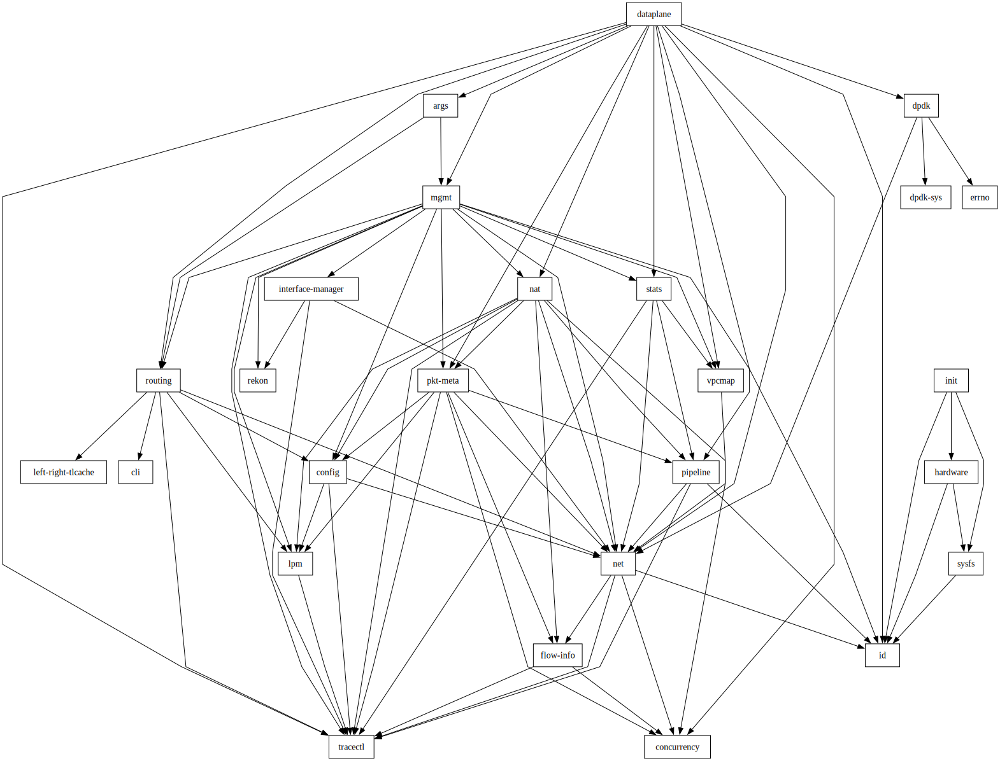

# Hedgehog Dataplane

[](https://app.fossa.com/projects/custom%2B43661%2Fgithub.com%2Fgithedgehog%2Fdataplane?ref=badge_shield)

This repository contains the Dataplane for [Hedgehog's Open Network Fabric][fabric-docs].
This component acts as a gateway between different VPCs managed by the Fabric, or to communicate with endpoints outside
of the Fabric.

[fabric-docs]: https://docs.githedgehog.com

## Build instructions

### Prerequisites

- A recent `x86_64` linux machine is required for development
- [Nix][nix] (the nix-shell provides the full toolchain, including Rust, Cargo, and all required libraries).
  The single-user installation is recommended unless you are familiar with nix and prefer the multi-user installation;
  both will work.
- [just][just] (task runner — install through your package manager or `nix-env -i just`)

[nix]: https://nixos.org/download/#nix-install-linux
[just]: https://github.com/casey/just

### Step 0. Clone the repository

```bash
git clone git@github.com:githedgehog/dataplane.git
cd dataplane
```

### Step 1. Enter the nix-shell

From the source directory, enter the development shell:

```bash
nix-shell
```

or equivalently

```bash
just shell
```

This provides the full development toolchain, including Rust, Cargo, Clippy, `cargo-nextest`, and all required
libraries and system dependencies.

### Step 2. Build the project

Inside the nix-shell, you can run

```bash
cargo build
```

to build default workspace members, or build specific packages:

```bash
cargo build --package=dataplane
```

You should now have an ELF executable in `target/x86_64-unknown-linux-gnu/debug/dataplane`.

You can build in release mode with

```bash
cargo build --package=dataplane --profile=release
```

at which point you should have an executable in `target/x86_64-unknown-linux-gnu/release/dataplane`.

To build a container image:

```bash
just build-container
```

To push a container image:

```bash
just push
```

### Step 3. Run the tests (debug mode)

To run the test suite, you can run

```bash
cargo test
```

To run the test suite under release mode

```bash
cargo test --profile=release
```

This covers basic testing and building of dataplane, but [there is more to testing dataplane](./testing.md).

## IDE Setup

The nix-shell provides the full toolchain, so IDE setup is straightforward.
Here are the suggested configurations for various IDEs:

### VSCode Setup

Launch VSCode from within the nix-shell so that rust-analyzer and other tools can find the correct toolchain:

```bash
nix-shell --run "code ."
```

> [!NOTE]
> VSCode must be started from within the nix-shell, otherwise the correct rust-analyzer will not be found.

Add the following to your `.vscode/settings.json` file:

```json
{
  "rust-analyzer.check.command": "clippy",
  "[rust]": {
    "editor.defaultFormatter": "rust-lang.rust-analyzer",
    "editor.formatOnSave": true
  }
}
```

### Zed Setup

Save the following to the `.zed/settings.json` file:

```json
{
  "languages": {
    "Rust": {
      "formatter": "language_server",
      "format_on_save": "on"
    }
  },
  "lsp": {
    "rust-analyzer": {
      "binary": {
        "path": "nix-shell",
        "arguments": ["--run", "rust-analyzer"]
      },
      "initialization_options": {
        "check": {
          "command": "clippy"
        }
      }
    }
  },
  "dap": {
    "CodeLLDB": {
      "binary": "nix-shell",
      "args": ["--run", "lldb-dap"]
    }
  },
  "terminal": {
    "shell": {
      "program": "nix-shell"
    }
  }
}
```

Zed wraps rust-analyzer and the debugger with `nix-shell --run`, so it does not need to be launched from the
nix-shell.

## Code organization

The dataplane code is organized in a set of crates.
All crates aren't equal (or they are but some are more equal than others).
The `dataplane` crate contains the main binary and may include any other as a dependency.
The crates developed within this project are aliased to `dataplane-NAME` and referred to as internal.
Since Rust is not a good friend of circular dependencies, here come some guidelines to avoid those.

### Dependencies

There is a set of low-level infrastructure crates (tier-1) with limited internal dependencies which many other crates
may refer to.
The tier-1 set of crates includes: `net`, `pipeline`, `lpm` or `config`.
Note that some of those refer to the others (e.g. `net` is a dependency of `pipeline`).

A second tier of crates use the prior set to add extended functionalities.
These include `nat` or `routing`.
These crates may have `config` as dependency, but not vice-versa.
I.e. in general, tier-n can only have as dependencies, crates in tier-k, k<=n.
Finally, crate `mgmt` (tier-3) may make use of any the internal crates (tier-1 and tier-2).
No other crate (other than `dataplane`) (tier-4) should depend on `mgmt`.

### Dependency cheat-sheet

- No crate should ever depend on `dataplane`.
- No crate except `dataplane` should depend on `mgmt`.
- Crate `config` should never depend on tier-2 crates (e.g. `nat` or `routing`).
- The general rule is that a tier-n crate can only have as dependencies crates in tier-k, k<=n.
- In other words, in a graphical representation as below, dependency arrows can never go upwards.

```text
     ┌─────────────────────────────────┐
     │           dataplane             │
     └┬───────────┬─────────┬──────────┘
      │           │         │
      │           │         │
      │           │   ┌─────▼────┐
      │           │   │          │
      │           │   │   mgmt   ┼───────────────┐      tier-3
      │           │   │          │               │
      │           │   └┬───────┬─┘               │
      │           │    │       │                 │
 ┌────┘      ┌────▼────▼┐   ┌──▼───────┐         │
 │           │          │   │          │         │
 │     ┌─────┼   nat    │   │ routing  ┼───────┐ │      tier-2
 │     │     │          │   │          │       │ │
 │     │     └──────┬───┘   └──────────┘       │ │
 │     │            │                          │ │
┌▼─────▼───┐  ┌─────▼────┐  ┌──────────┐  ┌────▼─▼───┐
│          │  │          │  │          │  │          │
│   net    │  │   lpm    │  │ pipeline │  │ config   │  tier-1
│          │  │          │  │          │  │          │
└───▲──────┘  └──────────┘  └───┬──────┘  └──────────┘
    │                           │
    └───────────────────────────┘
```

## Workspace Dependency Graph



**Figure**: full workspace dependency graph.
Note that tier-1 packages (like net) never depend on tier-2 packages (like nat).

## License

The Dataplane of the Hedgehog Open Network Fabric is licensed under the [Apache License, Version 2.0](LICENSE).
