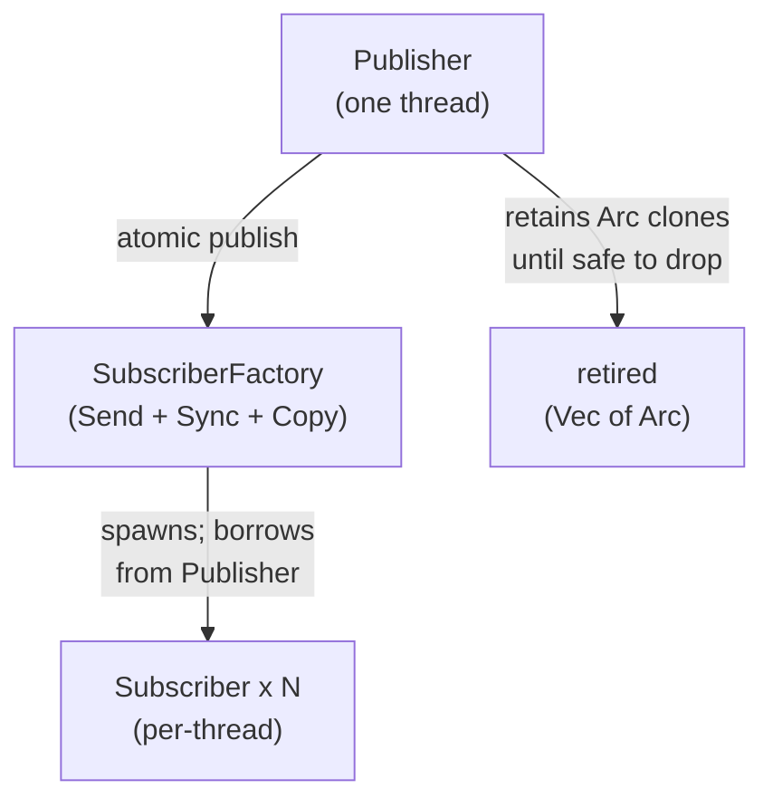
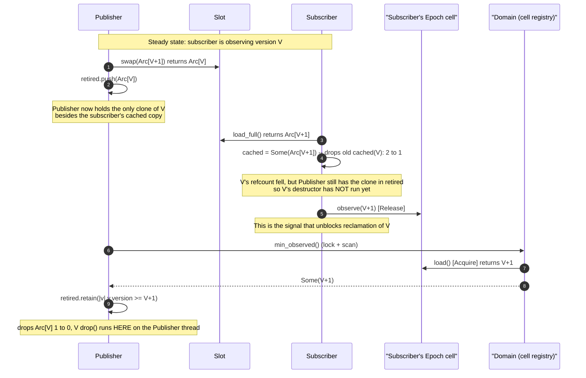
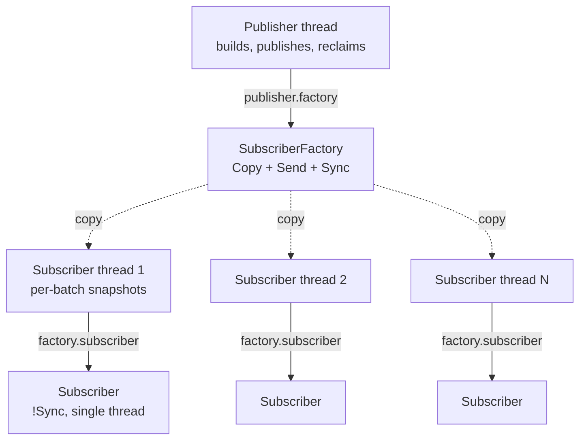
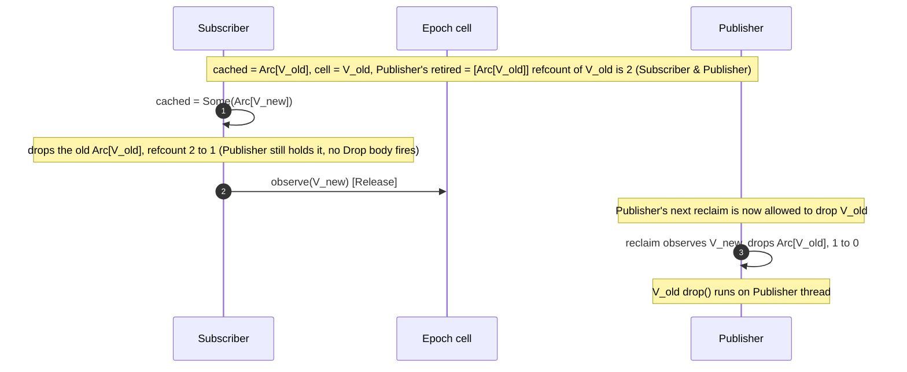
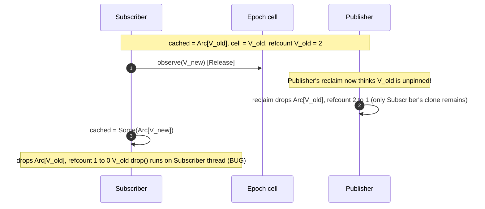
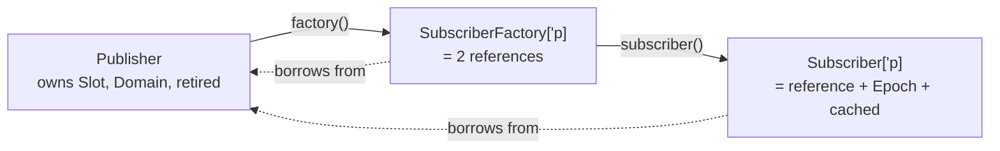

# quiescent

A small, generic Quiescent State Based Reclamation (QSBR) primitive.

The crate publishes immutable snapshots of a value of type `T` to many
single-thread subscribers, and guarantees that the **destructor of any
published value runs on the publisher's thread**. That guarantee
matters when `T` (or anything `T` transitively owns) has a thread-bound
`Drop`; a DPDK ACL context, an `rte_flow` handle, a hardware-table
descriptor, anything that has to be freed from the same lcore that
allocated it.



## Quick start

```rust,ignore
use dataplane_quiescent::channel;

#[derive(Debug)]
struct MyConfig { /* ... */ }

let publisher = channel(MyConfig { /* ... */ });

std::thread::scope(|s| {
    // Spawn one or more consumer threads.
    let factory = publisher.factory();
    for _ in 0..n_consumers {
        let factory = factory; // factory is Copy
        s.spawn(move || {
            let mut sub = factory.subscriber();
            for _ in 0..many_batches {
                let cfg = sub.snapshot();
                // ... use cfg for this batch ...
            }
        });
    }

    // Publish updates from the calling thread.
    publisher.publish(MyConfig { /* updated */ });
});
// Publisher drops here.  All retired MyConfig values drop on this
// thread.  Drop affinity preserved.
```

## The problem QSBR solves

A dataplane has one thread that mutates configuration (the _publisher_)
and many threads that read configuration on the hot path (the
_subscribers_). Updating shared state without coordination would race;
locking on the read side would tank latency.

The classic fix is copy-on-write: the publisher allocates a new version
of the state and atomically swaps it in. Old subscribers keep using
the old version until they're ready to look at the new one; new
subscribers immediately see the new version.

The leftover problem is **when can the old version be freed?** As long
as some subscriber still holds a pointer to it, freeing is a
use-after-free.

QSBR's answer: have each subscriber periodically declare a _quiescent
state_; an explicit "I am not currently holding any reference to a
shared snapshot." Old versions are reclaimable once **every**
subscriber has passed through a quiescent state since the version
became old. In a packet-batch dataplane, the natural quiescent state
is the **batch boundary**: between two batches, the lcore holds no
borrows to the configuration.

Memory reclamation is the headline benefit, but the load-bearing
property in this crate is one step stronger:

> **The destructor of every published value runs on the publisher's
> thread.**

This is what makes the crate safe to use with FFI handles whose
`Drop` impls have a thread requirement.

## The algorithm in one diagram



The two non-obvious facts encoded in that diagram:

1. **The publisher always holds the last clone of any retired
   version.** Subscribers' `cached` Arcs are merely _additional_
   clones; they keep the allocation alive but never trigger the inner
   `Drop`. The publisher's `retired` Vec is what decides when the
   destructor fires and on which thread.

2. **Subscribers signal "I have moved past V" by storing into their
   epoch cell after replacing their cached Arc.** The Release-Acquire
   pair on the cell carries the publisher safely from "V is pinned" to
   "V is reclaimable."

## API shape

Three types and one constructor. Each type's role and threading
profile:

| Type                         | Owns                                                         | `Send`/`Sync`/etc.   | Lifetime                 |
| ---------------------------- | ------------------------------------------------------------ | -------------------- | ------------------------ |
| [`Publisher<T>`]             | publication slot, retired list, version counter, QSBR domain | `Send + !Sync`       | owns its state           |
| [`SubscriberFactory<'p, T>`] | a pair of references to the Publisher's slot and domain      | `Send + Sync + Copy` | borrows from `Publisher` |
| [`Subscriber<'p, T>`]        | a per-thread observation cell, a per-thread cached Arc       | `Send + !Sync`       | borrows from `Publisher` |

Construction:

```rust,ignore
use dataplane_quiescent::channel;

let publisher = channel(initial_value);
```

[`channel`] returns the [`Publisher`] alone. Subscribers are obtained
via [`Publisher::factory`]. The factory and any subscribers it spawns
borrow from the publisher; the borrow checker enforces "subscribers
cannot outlive publisher" at compile time, which is what makes the
drop-affinity guarantee structural.

## Threading model



- Exactly **one Publisher thread**. `Publisher: !Sync` means the
  Publisher value can't even be borrow-shared across threads, much
  less mutated from two threads. The `Send` side of `!Sync` lets you
  move the Publisher to its owning thread once at startup.
- Many **`SubscriberFactory`** clones, freely shareable across threads.
  The factory holds nothing but borrowed references -- `Copy` is sound,
  cloning is basically free.
- Many **`Subscriber`** instances, one per consumer thread.
  `Subscriber: !Sync` ensures one snapshot per subscriber per batch;
  the embedded epoch cell tracks one specific thread's observed
  version; sharing it would scramble QSBR.

In production, the consumer threads are typically DPDK lcores spawned
inside a `std::thread::scope`; the publisher's thread is the build
worker spawned in the same scope. The scope's lifetime is what `'p`
binds to.

## Snapshot: cache, then observe (load-bearing order)

The single most important line in the implementation:

```rust,ignore
self.cached = Some(latest);  // <-- drop the old cached Arc FIRST
self.epoch.observe(version); // <-- THEN tell the publisher we've moved
```

Reordering those two statements would be a soundness bug. The
sequence diagrams below show why.

### Correct order: drop-old, then observe



### What goes wrong if you reorder them



The fix-by-construction is just "do these two statements in this
order, always."

## Subscriber drop: cache, then epoch (also load-bearing)

The same principle applies when a `Subscriber` drops: `cached` must
drop before `epoch`.  Field declaration order on `Subscriber` puts
`cached` before `epoch`, so Rust's default field-drop order already
honours this.  The crate's `Drop` impl explicitly clears `cached`
first as belt-and-suspenders, so the invariant survives anyone
reordering the fields without thinking about it:

```rust,ignore
impl<T> Drop for Subscriber<'_, T> {
    fn drop(&mut self) {
        self.cached = None; // drop the Versioned Arc clone FIRST
        // remaining fields drop after this; in particular the Epoch
        // (whose Arc<CachePaddedCounter> drop is what tells the
        // Publisher's reclaim "this Subscriber is gone").
    }
}
```

The reasoning mirrors the snapshot ordering: the Subscriber must drop
its Arc clone of the cached `Versioned` before the `Publisher` learns
it's safe to reclaim, otherwise the `Subscriber`'s drop becomes the last
clone-drop and the inner destructor runs on the wrong thread.

## Reclaim discipline: the registry and the 0-sentinel

The Publisher's `reclaim` consults its internal `Domain` (the registry
of per-Subscriber observation cells) to compute the **lowest version
any live `Subscriber` is currently pinning**. Every retired version below
that watermark is reclaimable.

```mermaid
sequenceDiagram
    autonumber
    participant P as "Publisher::reclaim"
    participant D as "Domain (Mutex[Vec[Arc[Cell]]])"
    participant Cs as "Subscriber cells"

    P->>D: lock active list
    loop for each cell in active
        D->>D: strong_count(cell) == 1?
        alt yes (Subscriber gone)
            D->>D: drop entry (false)
        else no (Subscriber live)
            D->>Cs: load() [Acquire]
            Cs-->>D: observed
            alt observed == 0 (registered, mid first snapshot, or idle)
                D->>D: any_in_flight = true (forces Some(Version::INITIAL); pins all retired)
            else observed > 0
                D->>D: track min if observed < min
            end
        end
    end
    D-->>P: Option[Version]
    alt Some(min)
        P->>P: retired.retain(|v| v.version >= min)
    else None (no live Subscribers)
        P->>P: retired.clear()
    end
```

Two sentinels worth highlighting:

- **`Arc::strong_count(cell) == 1`** means only the Domain holds the
  cell -- the corresponding Subscriber is gone. The Subscriber's
  `Epoch` was the only other strong reference, and it dropped when
  the `Subscriber` dropped.
- **`observed == 0`** means the `Subscriber` is either freshly
  registered or in the middle of its first `snapshot()` call (between
  `load_full` returning and `observe` running).  In the latter case
  the `Subscriber` already holds an `Arc<Versioned>` via the snapshot
  function's local variable that `min_observed` cannot see, so we
  conservatively **pin every retired version** until the `Subscriber`
  observes a real `Version`.  Once a `Subscriber` has called `observe`
  once, its cell is monotonically non-zero for the rest of its life
  (`Version` is `NonZero<u64>`), so the `0`-cell window closes
  permanently after that first observation.

  The corollary: a `Subscriber` that is registered but never calls
  `snapshot()` (e.g. its consumer thread parks before the first batch,
  or registration happens far ahead of first use) keeps its cell at
  `0` indefinitely, and reclamation stays pinned for as long as that
  `Subscriber` lives.  This is an unbounded-memory failure mode for
  callers that hold idle `Subscriber`s -- construct each `Subscriber`
  immediately before its first batch, not at thread startup.

## Lifetime invariant: subscribers cannot outlive the publisher



Every `SubscriberFactory<'p, T>` and `Subscriber<'p, T>` carries a
lifetime brand `'p` tied to a `&Publisher<T>` borrow. The borrow
checker therefore refuses any program in which a `Subscriber` outlives
the `Publisher`. This makes the destructor-thread-affinity guarantee a
**compile-time** property, not a documented contract.

In practice:

```rust,ignore
use dataplane_quiescent::channel;

let publisher = channel(initial);

std::thread::scope(|s| {
    let factory = publisher.factory();
    s.spawn(move || {
        let mut sub = factory.subscriber();
        loop {
            let snap = sub.snapshot();
            // ... use snap for one batch ...
        }
    });

    // Publisher operations happen here on the calling thread, freely
    // interleaved with the spawned thread:
    publisher.publish(new_value);
    publisher.reclaim();
});
// Scope joins all spawned threads.  Subscribers all dropped.
// Publisher drops next, on this (calling) thread.  Last clones of
// retired Versioneds drop here too.
```

`Publisher::publish` and `Publisher::reclaim` take `&self` rather than
`&mut self`. This is necessary because the factory borrows the
`Publisher` shared, and a `&mut self` method would conflict. Internal
mutability is `RefCell` for `retired` and `Cell` for `next_version`;
no runtime cost in release builds, and the `!Sync` invariant means the
borrow checks the `RefCell` performs _cannot_ actually fail.

## Memory ordering

Cross-thread synchronization rests on three pairs:

| Operation                        | Publisher side                   | Subscriber side                    |
| -------------------------------- | -------------------------------- | ---------------------------------- |
| The publication itself           | `Slot::swap` (Release)           | `Slot::load_full` (Acquire)        |
| The "I have moved past V" signal | `cell.load` (Acquire) in reclaim | `cell.store` (Release) in snapshot |
| The active-list registry         | `Mutex` lock/unlock              | `Mutex` lock/unlock                |

Combined with the cache-then-observe ordering on the `Subscriber` side
and the always-retain-a-clone discipline on the `Publisher` side, this
is sufficient for QSBR correctness.

## Limitations

- **Single publisher.** The `!Sync` Publisher and `&self` publish/
  reclaim methods enforce single-thread-publish via interior mutability
  on the publisher's own thread. Multi-publisher would require a
  different design.
- **Reclaim runs synchronously on every publish.**
  `Publisher::publish` runs a reclaim pass before returning, which
  adds the cost of one `min_observed` scan (a `Mutex` acquire on the
  QSBR domain plus a `strong_count` + `cell.load` per registered
  Subscriber) to every publish.  The standalone `Publisher::reclaim`
  is exposed for callers who want to drive reclamation between
  publishes; it does not skip the reclaim that `publish` already
  performs.  We don't currently expose a "publish without reclaim"
  variant because the typical control-plane publish rate is sub-Hz,
  but if the scan cost ever becomes load-bearing that is the knob to
  add.  There is no way to _force_ reclamation past a stuck
  Subscriber other than dropping that Subscriber.
- **Subscribers must be inside a `thread::scope`** (or otherwise
  lifetime-bounded by the Publisher). `std::thread::spawn` won't work
  because it requires `'static`.
- **Loom cannot exhaustively test the lifetime-bounded API** because
  loom 0.7.2 doesn't expose `thread::scope`. The crate's loom tests
  use a `Box::into_raw` / `Box::from_raw` shim to lift the Publisher
  to `'static` for the iteration; see `tests/loom.rs`.
