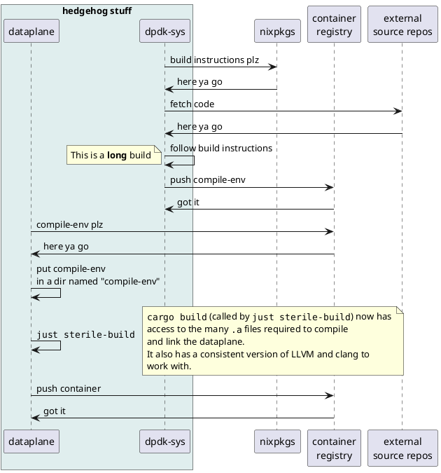

# The build system

If you consider the whole process, the `dataplane` (by necessity) has a fairly complex build.
Thus, much effort has gone into creating the illusion of simplicity and ease for the developer.

<figure title="Build-system data-flow">

> Sequence diagram for dpdk-sys / dataplane interaction.
</figure>
