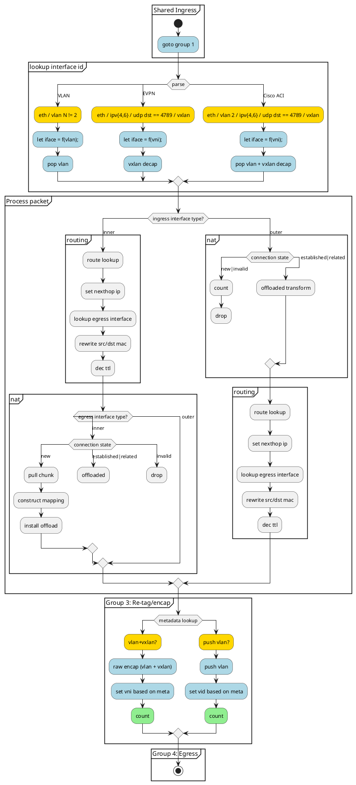

# Offloading the dataplane

<figure title="Packet processing flow chart">

```plantuml
@startuml
!pragma teoz true
!$sty = {
	"question": "#gold",
	"action": "#lightblue",
	"future": "#lightgreen",
	"attention": "#pink"
}
!$action = $sty.action
!$question = $sty.question
!$future = $sty.future

group Shared Ingress
start
$action:goto group 1;
end group

group lookup interface id
switch (parse)
case (VLAN)
  $question:eth / vlan N != 2;
  $action:let iface = f(vlan);;
  $action:pop vlan;
case (EVPN)
  $question: eth / ipv{4,6} / udp dst == 4789 / vxlan;
  $action:let iface = f(vni);;
  $action:vxlan decap;
case (Cisco ACI)
  $question:eth / vlan 2 / ipv{4,6} / udp dst == 4789 / vxlan;
  $action:let iface = f(vni);;
  $action:pop vlan + vxlan decap;
endswitch
end group

group Process packet
  
  switch (ingress interface type?)
    case (inner)
      group routing 
        :route lookup;
        :set nexthop ip;
        :lookup egress interface;
        :rewrite src/dst mac;
        :dec ttl;
      end group
      group nat
        switch (egress interface type?)
          case (inner)
            switch (connection state)
            case (new)
              :pull chunk;
              :construct mapping;
              :install offload;
            case (established|related)
              :offloaded;
              detach
            case (invalid)
              :drop;
              detach
            endswitch
          case (outer)
        endswitch
      end group
    case (outer)
      group nat
        switch (connection state)
          case (new|invalid)
            :count;
            :drop;
            detach;
          case (established|related)
            :offloaded transform;
        endswitch
      end group
      group routing
        :route lookup;
        :set nexthop ip;
        :lookup egress interface;
        :rewrite src/dst mac;
        :dec ttl;
      end group
  endswitch


end group

group Group 3: Re-tag/encap

switch (metadata lookup)
case ()
  $question:vlan+vxlan?;
  $action:raw encap (vlan + vxlan);
  $action:set vni based on meta;
  $future:count;
case ()
  $question:push vlan?;
  $action:push vlan;
  $action:set vid based on meta;
  $future:count;
endswitch
end group

group Group 4: Egress
stop
end group

@enduml
```

> How it's done

</figure>
