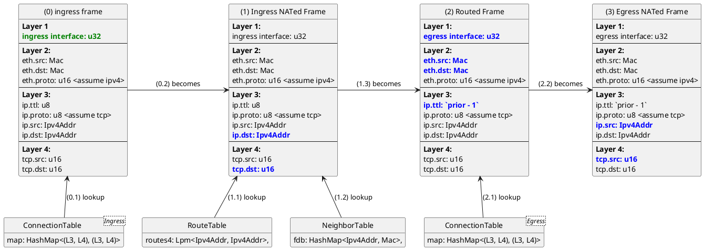
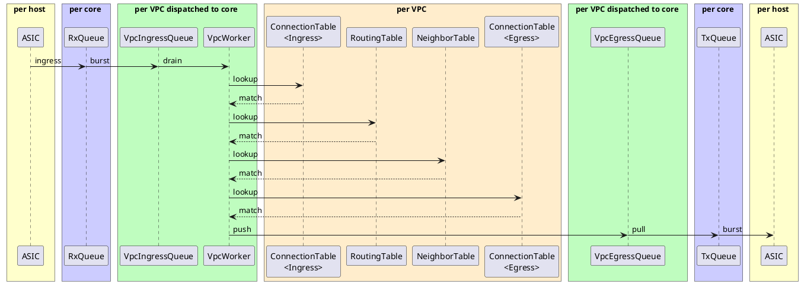
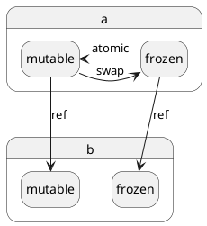
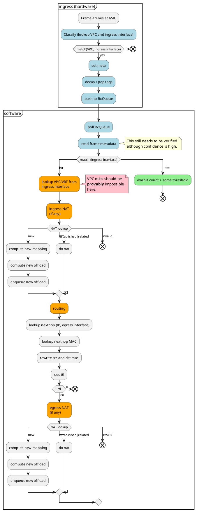
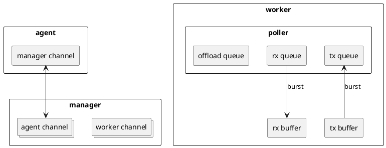

# Scratch

## Performance considerations

### Configuration information updates

Optimizing for configuration rate update at this point is absurd.
Pay it no mind.

Even poor _write_ performance is fine in the short term.
Read performance is slightly more concerning, be even that is a relatively modest issue.

Configuration data is neither large nor frequently updated.

We should instead focus on other properties:

1. _strong_ durability,
2. _strict_ referential integrity,
3. immediate consistency,
4. transactional updates,
5. partition tolerance.

Ideally, we would also get

1. reversible operation log,
2. rewind capability,
3. integration with the rest of the telemetry stack.

### Route information updates

Optimize for _thousands_ of sustained route updates per second.
Not millions.
There is no point in optimizing for route table thrashing.
Any network will behave poorly under those conditions (all of which reflect incorrect control plane behavior).

The only times when route update performance is expected to be the controlling factor are:

1. system startup,
2. major changes to peers.

Both of which are transient and well suited to batch-oriented updates.

Still, it is also important to consider the fact that even modest updates to the routing table can cause updates to the connection tracking tables as well.

### Connection tracking information updates

Connection tracking information updates _very_ quickly.
We can expect a sustained rate of hundreds of thousands of updates per second.
The rate at which connections can be offloaded (and the latency of installing and removing those offloads) is certain to be governing property in system performance overall.

The faster the offload is installed, the more quickly the processing of that flow becomes the network card's problem.
And the network card is very efficient.
Hardware offloading makes a huge difference, so we need to focus on rapidly installing offloads.

## Transactionality

[left-right] is lit.

[left-right]: https://github.com/jonhoo/left-right

## Packet walk

