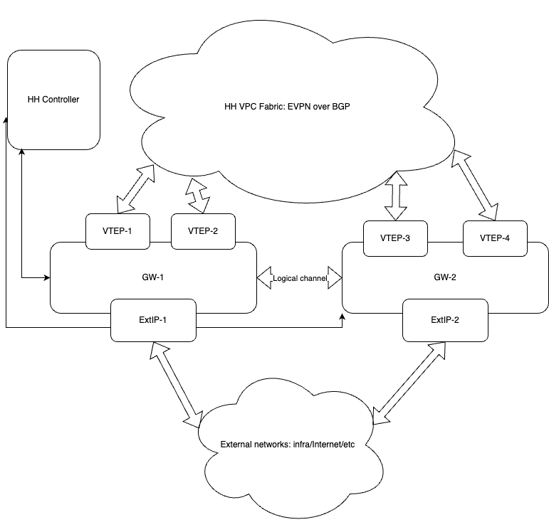
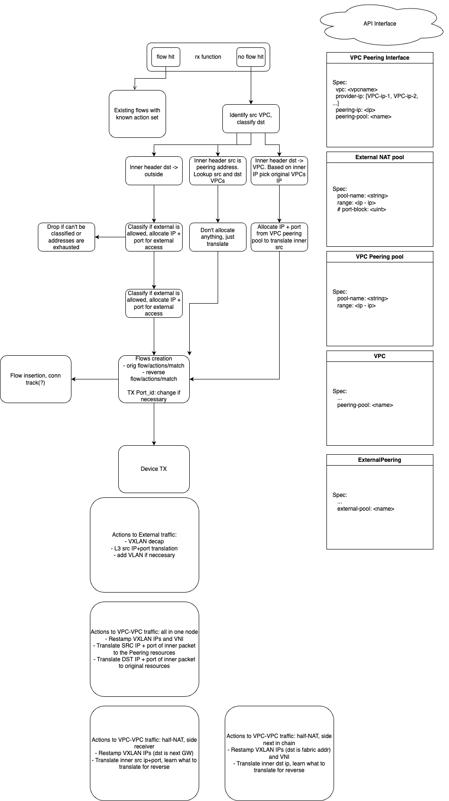

# NAT Function Design for Hedgehog Dataplane Component

## Glossary

- **Fabric**: Networking fabric managed by Hedgehog Fabric Controller.
- **Fabric Gateway (GW)**: Exit point of Hedgehog fabric, also known as Hedgehog Dataplane.
- **Peering IP Pool**: A user-defined preconfigured range or ranges of IP addresses used by VPC Fabric either to make a service available from other sites or VPCs, or to hide the real IP of the service consumer.
- **Peering IP**: An IP address from the Peering IP Pool.
- **External IP Pool**: A user-defined preconfigured range or ranges of IP addresses used to translate original VPC addresses for traffic that originates to non-fabric destinations, like the Internet or another local L3-routed network.
- **External IP Address**: An IP address from the External IP Pool.
- **NAT Binding**: A combination of NAT IP address and port associated with a private IP.

## NAT Function Overview

As a part of Hedgehog Fabric, the Gateway is an exit point for all traffic as well as a default gateway for cross-IPNamespace connectivity. The Fabric Gateway is also a default gateway for all service consumers that are originating traffic to any Peering IP. The NAT function should also provide static availability of certain VPC resources to be accessible from the externally connected networks.

### Feature Enablement

Hedgehog NAT Function (or HH NAT) picks up a packet from the RX function of the Hedgehog Gateway and, as a result, should create a list of actions that should be applied on traffic with a given pattern. Basically, the function should identify what packet fields should be changed and where traffic should be forwarded. The NAT function should also manage IP address and port allocation for VPC traffic.

### Basic Concepts

HH NAT function can perform several base actions on top of the packet. There are several common features needed to manage traffic.

#### Traffic Classification

HH NAT function should identify traffic destination as:

- VPC traffic to another VPC
- VPC traffic to outside networks
- Traffic from outside to VPC
- Site-to-site VPC traffic

#### VPC Lookup

HH NAT function should be able to perform a source and destination VPC lookup. Based on traffic classification, several lookups should be implemented:

- **VPC lookup by VNI**: Each VPC should be identified by the VNI of the L2EVPN underlay.
- **VPC lookup by Peering IP**: User-defined assignment of NAT Binding for defined private IP.

#### IP Address and Port Allocation

NAT function should allocate IP address and port (if needed) based on traffic destination and source VPC. Allocation should be local; the IP+port pair should be unique.

#### Packet Rewrite and Checksum/CRC Recalculation

As an output of the NAT function, there should be a list of actions to be performed on top of the packet, like VXLAN/VNI rewrite, IP rewrite, and TCP/UDP rewrite.

(Q: Can the RTE_FLOW do it? Also, can we recalculate CRCs?)

#### NAT Actions

There are common actions that can be performed on top of the packet:

- Rewrite VXLAN header
- Rewrite inner IP header
- Rewrite inner Ethernet header
- Rewrite TCP/UDP header

### VPC to VPC Communication

If traffic is classified as originating from a Fabric VPC to another VPC or Peering IP, HH NAT function should:

1. Make all needed lookups to identify source and destination VPC.
2. Allocate Peering IP address from the pool, allocate a free-to-use port if necessary.
3. Identify destination VPC VNI and destination VXLAN address (from FRR and API).
4. Generate all needed actions for flow and pass it to the flow controller.

The following steps can be executed on several Gateways; please see Use Cases.

### External/Side Network Access

Based on classification, if traffic is originated towards a non-peering or non-VPC IP address, traffic should go towards the externally connected networks.

1. Make all needed lookups and identify source VPC.
2. Based on source VPC, identify associated External NAT Pool(s).
3. Allocate External IP address from the pool, allocate a free-to-use port if necessary.
4. Generate all needed actions for flow and pass it to the flow controller.

### Static External Access

HH NAT function should provide one-to-one static assignment if the user defined that a certain VPC server should be reachable from the externally connected networks. Static NAT should have higher priority in the translation order.

## Use Cases Description

NAT (Xform) function is a part of the Hedgehog Fabric Gateway that is dedicated to providing Fabric traffic forwarding, IP address translation, and traffic routing. There might be several deployment use cases for the Fabric Gateway and how it can apply the NAT function.

### Single GW Deployment

If there is a single GW present in Fabric, it is acting as a default exit point for all traffic originated from VPCs to Peering IPs, external networks, and VPCs from another IP Namespace. Simplified algorithm of actions is the following:

1. Receive the packet from RX function.
2. Classify traffic based on destination.
3. Based on the classification, identify (lookup): source VPC, destination VPC. Depending on traffic origin, source or destination VPC may not be present.
4. Check if Static NAT binding is present; if so, go to step 6.
5. Allocate Peering NAT Binding or External NAT binding.
6. Identify if VXLAN rewrite is needed (or we need to pop VXLAN if traffic goes to a pure L3 network).
7. Create actions for forward and reverse flows: inner header rewrite, outer header rewrite, recalculate CRC/checksum.
8. Create matching pattern for forward and reverse flows.

### Full NAT

If there are more than one GW deployed, each of the GWs can be the default GW for any particular VPC, but both can't advertise the default route to the same VNI. This means that if there are two VPCs communicating through the HH GW, all traffic processing may land on a single GW, but may not.

The situation where two VPCs have the same GW as the default is exactly the same as for Single GW deployment.

### Half-NAT

However, if two VPCs in communication have separate GWs as defaults, traffic should be processed by both GWs. Each of the Gateways will translate the source VPC part if traffic comes from a VPC, and the destination VPC part if traffic comes from another GW:

1. Receive the packet from RX function.
2. Classify traffic based on destination.
3. Based on the classification, identify (lookup): source VPC, destination VPC. Depending on traffic origin, source or destination VPC may not be present.
4. Check if Static NAT binding is present; if so, go to step 6.
5. If by classification traffic came from another Gateway, don't allocate anything.
6. Identify if VXLAN rewrite is needed (or we need to pop VXLAN if traffic goes to a pure L3 network).
7. Create actions for forward and reverse flows: inner header rewrite, outer header rewrite, recalculate CRC/checksum. If traffic should be forwarded to another GW, don't translate inner header destination. If traffic comes from another GW, don't translate the source.
8. Create matching pattern for forward and reverse flows.

### OVN Integration

<tbd>

### Diagram

