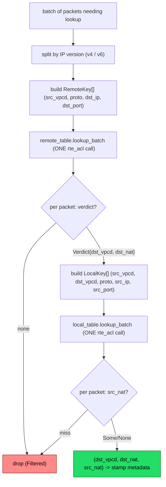

<!--
SPDX-License-Identifier: Apache-2.0
Copyright Open Network Fabric Authors
-->

# flofi: two-table redesign (batchable ACL topology)

Status: IMPLEMENTED (single-key lookup). `context/tables.rs` now builds the four wide tables
(`{remote,local} x {v4,v6}`) with `src_vpcd`/`dst_vpcd` as exact fields and proto as a mask
field, behind an `AnyTable` enum (`Reference` | `Dpdk`) selected by `PeeringTables::build(overlay,
Backend)`. Production uses `PRODUCTION_BACKEND = Reference` (keeps the suite fast/EAL-free); the
`Dpdk` rte_acl backend is validated by a differential test (`reference_and_dpdk_backends_agree`)
that asserts identical lookups from the same overlay. All 41 semantic tests (unchanged) still
pass, so the new topology is behaviourally identical to the old fan-out. STILL TODO: the batched
two-pass `process` path (AnyTable::Dpdk exposes `lookup_batch`); then flip `PRODUCTION_BACKEND`.

Field-encoding gate: VALIDATED against real `rte_acl` (see the spike test
`flofi_two_table_key_shapes_build_and_classify` in `acl/src/dpdk/dyn_table.rs`). The key
shapes below build and classify correctly under `#[dpdk::with_eal]`, including proto-as-mask,
one/two exact u32 VNI fields, v4/v6 prefixes, `/0` default rules, and `lookup_batch`.

## 1. Why change

The current topology dispatches to a *table per (source VPC) x (protocol)*, plus a second
per-(dst VPC) map for the local end:

```text
PeeringTables.v4 : HashMap<src_vpcd, VpcTable>
  VpcTable.remote_ends : { tcp, udp, other }        <- pick sub-table by proto
  VpcTable.local_ends  : HashMap<dst_vpcd, {tcp,udp,other}>
```

Two consequences:

- **Batching is unavailable.** The DPDK backend's fast path is `lookup_batch` (one
  `rte_acl` call classifies a whole batch; ~25ns/pkt batched vs ~48ns single in our
  benches). A batch of packets scatters across `{src_vpcd} x {proto} x {dst_vpcd}` tables,
  so there is no homogeneous batch to hand to it. `Flofi::process` is per-packet
  (`filter_map`) and calls single-key `lookup()`.
- **The abstraction boundary is one level too low.** `into_backend_fields::<RuleBackend>()`
  is backend-neutral for *one table*, but the fan-out topology above it is a
  reference-backend (linear-scan) optimization that will not transfer to a batched hardware
  backend. Swapping `RuleBackend = Erased` to the DPDK backend does not make flofi batch.

The reference backend is a differential-test oracle, not the production datapath (that is
rte_acl). So optimizing the topology for linear scan is optimizing the wrong backend.

## 2. Core idea

Move `src_vpcd`, `dst_vpcd`, and `proto` from *dispatch dimensions* into *ACL key fields*.
The staging stays (see rule-count below), but each stage collapses to a **single wide
table per IP version**. Total tables: **4** (down from potentially hundreds).

```text
remote_v4 : DpdkAclLookup<RemoteKey<Ipv4Addr>, Verdict>
remote_v6 : DpdkAclLookup<RemoteKey<Ipv6Addr>, Verdict>
local_v4  : DpdkAclLookup<LocalKey<Ipv4Addr>,  Option<NatRequirement>>
local_v6  : DpdkAclLookup<LocalKey<Ipv6Addr>,  Option<NatRequirement>>
```

The v4/v6 split is the one irreducible bucketing: prefix field width (4 vs 16 bytes)
differs, so the fixed rte_acl field layout differs.

## 3. Keys

`src_vpcd`/`dst_vpcd` lower to `u32` (`VpcDiscriminant` is a 1:1 wrapper over a 24-bit
`Vni`; `Vni::as_u32()`). `proto` is a **mask** field so "any protocol" needs no fan-out or
duplication: specific = value/`0xff`, any = value/`0x00`. The `MatchKey` derive generates
the companion `*Rule` type (`ExactSpec`/`MaskSpec`/`PrefixSpec`/`RangeSpec` per field) and
`into_backend_fields`.

`proto` MUST be the first field: rte_acl requires the first field def to be one byte
(`plan_layout` returns `FirstFieldNotOneByte` otherwise). The 1-byte proto satisfies this for
free -- a happy consequence of folding proto into the key. Field-def budget is comfortable:
rte_acl's `RTE_ACL_MAX_FIELDS` is 64; the widest key (`LocalKey<Ipv6Addr>`) uses 8
(proto 1 + 2x vni 1 + v6 prefix 4 + port 1).

```rust
// Stage 1 key: "which peer does this destination belong to?"
#[derive(MatchKey, Clone, PartialEq, Eq, Debug)]
pub(super) struct RemoteKey<I> {
    #[exact] src_vpcd: u32,   // scope: this source VPC's peers only
    #[mask]  proto: u8,       // any = 0x00 mask; tcp = 6/0xff; udp = 17/0xff; icmp = 1/0xff
    #[prefix] dst_ip: I,
    #[range] dst_port: u16,
}
// Stage 1 action:
//   pub(super) struct Verdict { dst_vpcd: VpcDiscriminant, nat_mode: Option<NatRequirement> }

// Stage 2 key: "is this source authorized to reach that peer, and with what src NAT?"
#[derive(MatchKey, Clone, PartialEq, Eq, Debug)]
pub(super) struct LocalKey<I> {
    #[exact] src_vpcd: u32,
    #[exact] dst_vpcd: u32,   // supplied by stage-1 Verdict
    #[mask]  proto: u8,
    #[prefix] src_ip: I,
    #[range] src_port: u16,
}
// Stage 2 action: Option<NatRequirement>   (src NAT; None = no NAT)
```

Correctness note: `src_vpcd` **must** be in the stage-1 key. `check_overlap_and_default`
(config) only forbids remote-prefix overlap *within one VPC's peers*; two different source
VPCs may expose overlapping public prefixes, so a merged table needs the VNI to
disambiguate.

## 4. Defaults become rules, not side-channels

`has_default` (bool) and `default_remote_vpcd` (Option) disappear. A default expose lowers
to a **lowest-priority wildcard rule**:

- remote default -> `RemoteKey { src_vpcd, proto any, dst_ip /0, dst_port * } -> Verdict { dst_vpcd = the-default-peer, nat_mode: None }`
- local default  -> `LocalKey  { src_vpcd, dst_vpcd, proto any, src_ip /0, src_port * } -> None`

rte_acl resolves precedence by priority, so a `/0` catch-all at the lowest priority is
matched only when no specific prefix does. This is more uniform than the current post-miss
`or_else`/`if has_default` checks, and it removes the "remote `has_default` is set but never
read in lookup" redundancy noted in review.

## 5. Build (sketch)

Per source VPC / IP version, emit rule specs and assign descending priority so specific
rules outrank the `/0` defaults, then build one classifier per table.

```rust
// pseudo: one accumulation pass over the overlay
for vpc in overlay:
    src = u32::from(vpc.vni())
    for peering in vpc.peerings():
        dst = u32::from(remote_vni(peering))
        for e in peering.remote().exposes().filter(can_receive_connection):
            for p in e.public_ips():
                remote[ipver(p)].push(RemoteKeyRule { src, proto: mask(e), dst_ip: p, dst_port: ports(p) }
                                        -> Verdict { dst_vpcd: dst, nat_mode: nat(e) })
        for e in peering.local().exposes().filter(can_init_connection):
            for p in e.ips():
                local[ipver(p)].push(LocalKeyRule { src, dst, proto: mask(e), src_ip: p, src_port: ports(p) }
                                        -> nat(e))
    // defaults -> lowest-priority /0 wildcard rules (section 4)

// each bucket -> RuleSpec { priority, category, into_backend_fields::<Dpdk>() }
//             -> build classifier -> DpdkAclLookup::new(classifier, actions, layout)
```

Rule count is unchanged in aggregate: additive M+N per peering (not the M*N cross product a
single flat table would need). We just consolidate many small tables into 4 wide ones.

## 6. Lookup: two batched passes



Two `rte_acl` calls per IP version per batch, regardless of protocol/VPC diversity. The
inter-stage data dependency (stage 2 needs `dst_vpcd` from stage 1) is *between* passes, not
within a batch, so both passes stay fully batched. Packets that miss stage 1 are compacted
out before building stage-2 keys (or given a sentinel `dst_vpcd` that matches no local rule).

```rust
// signature shape (per IP version); MAX_BATCH chunking elided
fn lookup_batch_v4(
    &self,
    pkts: &[Fields],                // src_vpcd, proto, src_ip, dst_ip, ports
    out: &mut [Option<Route>],      // (dst_vpcd, dst_nat, src_nat)
) {
    let rkeys: Vec<RemoteKey<Ipv4Addr>> = pkts.iter().map(RemoteKey::from).collect();
    let mut verdicts = vec![None; rkeys.len()];
    self.remote_v4.lookup_batch(&rkeys, &mut verdicts).unwrap();
    // compact hits, build LocalKey with verdict.dst_vpcd, batch stage 2, scatter back
    ...
}
```

## 7. `Flofi::process` change

`process` moves from per-packet `filter_map` to collect-classify-apply. It must partition the
batch first, because the flow-bypass path (section 4 of the crate README) must not go through
the tables:

1. Drain the input iterator (in `MAX_BATCH`-sized chunks).
2. Partition: (a) **bypass-eligible** (active, up-to-date flow) -> tag from flow state,
   per-packet, cheap; (b) **needs-lookup** -> collect into the batch.
3. Run the two-pass batched lookup on (b), split by IP version.
4. Apply per-packet: set `dst_vpcd` + NAT flags, attach flow_key for the stateful+static
   combo, run `should_invalidate_flow`.
5. Re-emit packets preserving input order (per the causality/ordering notes: within-flow
   order is preserved; cross-flow reordering inside the batch is semantically free, but
   keeping input order is simplest and cheap).

## 8. Open questions / validation gates

- **rte_acl field encoding.** DONE -- validated by the spike (proto mask + one/two exact u32
  VNI + v4/v6 prefix + port range build and classify; `lookup_batch` agrees with `lookup`;
  `/0` default rule works; proto-first constraint satisfied).
- **Build cost / capacity.** CHARACTERIZED by `flofi_build_capacity_probe`
  (`acl/src/dpdk/dyn_table.rs`, `#[ignore]`; RemoteKey<Ipv4Addr>, debug dpdk sysroot -- shape,
  not production ms). Findings:
    - Disjoint (config-legal) rules build ~linearly: 64->0.4ms, 1k->6ms, 16k->74ms, 64k->376ms.
      No OOM. Realistic tables (hundreds of rules) build in ~1ms.
    - Adversarial overlap (sliding, pairwise-overlapping port windows on one prefix) is
      super-linear: 1k->55ms, 4k->649ms, 16k->3.3s, 64k->13.3s -- ~35-44x the disjoint cost at
      equal N. Still no OOM: for this key shape the cost is build TIME (a control-plane reconfig
      DoS), not dataplane memory. rte_acl memory comes from the EAL heap (RSS is a poor proxy);
      an over-capacity build would surface as an ENOMEM `Err`, none seen to 64k.
    - Implication: the guardrail is a **per-table total-rule-count cap enforced at config
      processing time** (bounding reconfig latency), NOT a dataplane concern. Config already
      forbids the overlap that triggers the 35-44x penalty (non-default/non-masquerade prefixes
      can't overlap; masquerade srcs are separated by the exact dst_vpcd field), so real tables
      sit on the cheap linear curve. A cap of a few thousand rules/table keeps even a
      hypothetical adversarial build under ~1s and is orders of magnitude above realistic need.
    - Not yet measured: LocalKey (2 exact fields) and v6 (16-byte prefix -> more field defs);
      expected similar-to-slightly-heavier. Re-run on the release dpdk sysroot for absolute ms.
- **Priority assignment.** RESOLVED. Config (`check_overlap_and_default`,
  `validate_expose_collisions`) guarantees the only intra-table overlap is a specific prefix
  vs the `/0` default (masquerade dsts excluded from remote; overlapping masquerade srcs
  separated by the exact `dst_vpcd` field in local). So longest-prefix-match is sufficient,
  and rte_acl returns highest-priority (not longest), so we encode LPM as:
  `priority = prefix_len + 1` (dst len for remote, src len for local). The `+1` is required:
  `Priority` is `NonZero<i32>` with `MIN = RTE_ACL_MIN_PRIORITY = 1`, so `/0 -> 1` (lowest
  valid), `/32 -> 33`, `/128 -> 129`. proto specificity needs no tiebreak (a proto-specific
  and any-proto rule can only coexist at *different* prefix lengths, already ordered by len);
  add `*2 + proto_specific_bit` only as defensive headroom. Build-time requirement: emit rules
  **sorted by descending prefix length (defaults last)** so the reference backend's
  first-match precedence == rte_acl's highest-priority, keeping the differential oracle valid.

- **First field must be a one-byte bitmask (NOT specifically `#[exact]`).** RESOLVED.
  `#[exact]` and `#[mask]` both lower to `FieldType::Bitmask` (`field_type_of`); `exact_u8(v)`
  is `mask_u8(v, 0xFF)`. The wrapper's `InvalidFirstField` checks only `size == One` and
  `input_index == 0`, not exact-vs-mask. So `#[mask] proto` first is byte-identical to
  `#[exact]` at the FieldDef level and is valid (spike-confirmed). proto stays `#[mask]`, first.
- **Masquerade destinations.** Still excluded from `remote` (they cannot receive
  connections), so overlapping-masquerade-prefix configs remain a non-issue here.
- **MAX_BATCH.** Pick chunking; measure the crossover where batching wins over per-packet for
  realistic batch sizes.
- **Reference backend.** Keep it behind the same `Lookup` trait for differential tests; it
  will scan all rules per packet (acceptable for an oracle). Consider a `Backend` type param
  on the tables so tests use `Erased` and production uses `Dpdk`.

## 9. What is kept vs removed

| Kept | Removed / folded into keys |
|------|----------------------------|
| Two-stage lookup (dst then src) -- avoids M*N | `HashMap<src_vpcd, ...>` dispatch -> `#[exact] src_vpcd` |
| v4/v6 split (field width) | tcp/udp/other fan-out -> `#[mask] proto` |
| `Verdict { dst_vpcd, nat_mode }` action | `HashMap<dst_vpcd, ...>` (local) -> `#[exact] dst_vpcd` |
| Slot/ArcSwap hot-swap of the whole context | `has_default` / `default_remote_vpcd` -> `/0` rules |
| Exclusion filters (can_init / can_receive) | any-proto rule duplication (3x) |
