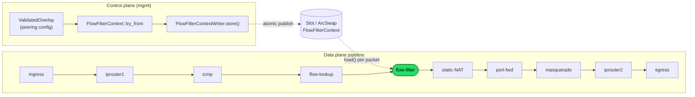
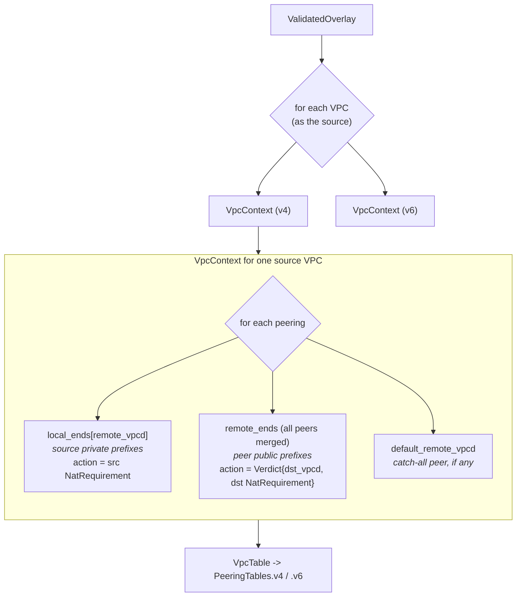
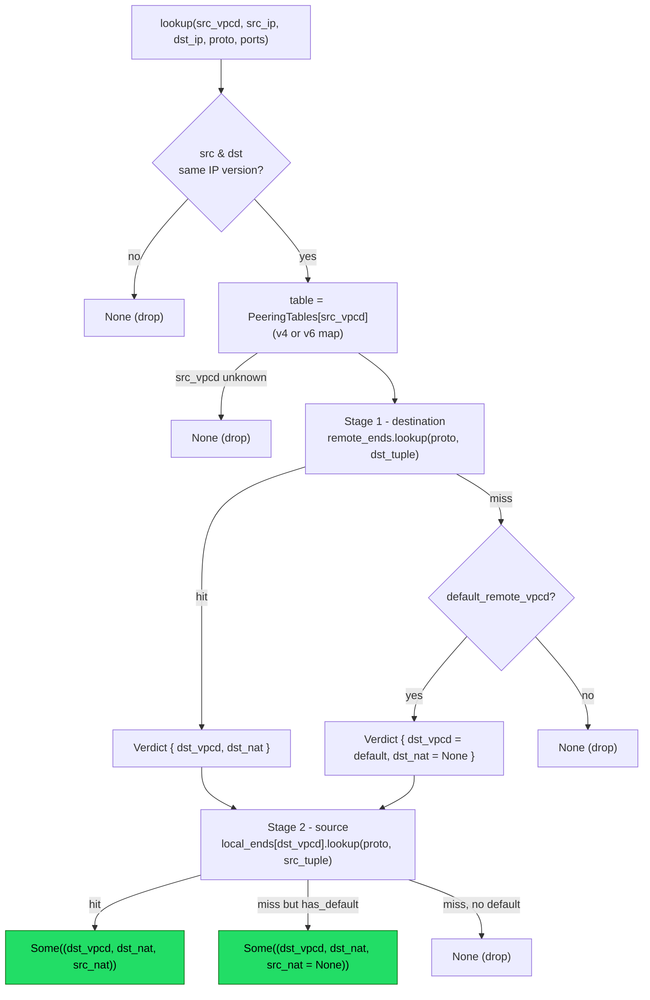
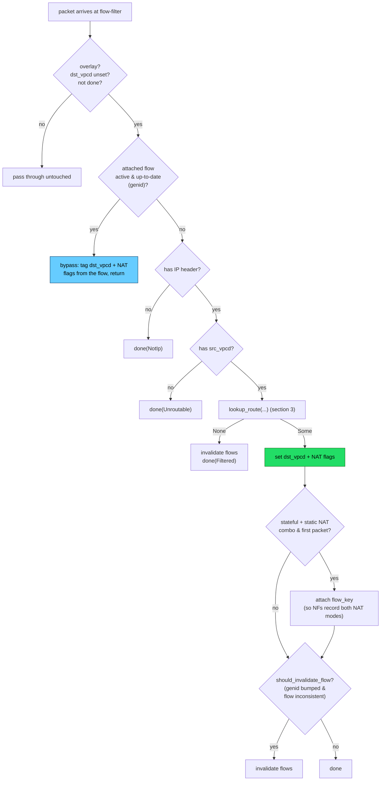

<!--
SPDX-License-Identifier: Apache-2.0
Copyright Open Network Fabric Authors
-->

# flow-filter

`flow-filter` is the pipeline stage that answers one question for every overlay packet:

> Given where this packet came from (source VPC + 5-tuple), **which destination VPC
> does it belong to, and what NAT does each end require** -- or should it be dropped?

It is a pure _classifier_. It never rewrites the packet; it only stamps decisions onto
the packet's metadata (`dst_vpcd`, NAT-requirement flags) for the downstream stateful
NFs (static-NAT, port-forwarder, masquerade) to act on.

---

## 1. Where the flow-filter sits

Two independent actors touch flow-filter: the **control plane** publishes a routing
context, and the **data plane** reads it per packet. They are decoupled by an `ArcSwap`
slot, so config can be swapped atomically while packets are in flight.

Key point: the flow-filter runs **after** `flow-lookup` (so a packet may already carry
flow state) and **before** the three NAT stages (which consume the flags the flow-filter
sets).

---

## 2. How config becomes lookup tables

The build step (`context/tables.rs`) turns the peering config into two ACL reference
tables per source VPC, per IP version. Think of it as splitting each peering into its
**local end** (the source's private prefixes) and its **remote end** (the peer's public
prefixes).

Rules are protocol-aware by encoding the packet's L4 protocol as the first ACL key byte:

- TCP/UDP rules match exactly (`mask 0xff`).
- `L4Protocol::Any` wildcards the proto (`mask 0x00`), so non-TCP/UDP packets only match `Any` rules.

Stateful-NAT exposes get special treatment while building, because only the *forward*
direction of their sessions can be answered from config alone:

- **local end** excludes port-forwarding exposes (`can_init_connection()`): a
  port-forwarding source cannot initiate, and a covering expose (e.g. masquerade) must
  answer for connection initiation from that range. Reply traffic *from* a
  port-forwarding-only source surfaces as a distinct stage-2 miss (`SourceMiss`), which
  the NF resolves against the packet's established flow.
- **remote end** keeps masquerade exposes, but only as *markers*: a masquerade
  destination cannot accept new connections, so the NF lets a masquerade verdict through
  only when the packet rides an established masquerade flow (reply traffic); otherwise it
  drops. The marker is what distinguishes that reply traffic from a destination no
  peering covers, which must fail closed.

---

## 3. The lookup: two stages

This is the heart of the crate (`PeeringTables::lookup_batch` /
`FlowFilterContext::lookup_route_batch`). The mental model is a two-question funnel:

1. **Where is the destination?** Match the _destination_ IP/port against `remote_ends`.
   That yields a `Verdict` = the destination VPC + the destination-side NAT mode. (If
   nothing matches, fall back to `default_remote_vpcd`.)
2. **Is this source allowed to reach it?** Using the dst VPC from step 1, look up the
   `local_ends` table _for that peer_ and match the _source_ IP/port. That yields the
   source-side NAT mode (or a `has_default` catch-all, or a miss = drop).

Why destination-first? A single source prefix can be exposed to several peers at once, so
the source alone is ambiguous. The destination prefix is what disambiguates _which_ peering
applies; only then can the source be validated against that specific peering's local end.

---

## 4. The per-packet path (`FlowFilter::process_burst`)

The lookup above is only reached for packets that need it. The NF first tries to
**bypass** the lookup using flow state left by `flow-lookup`, then batches ACL lookups for
the remaining packets and finally applies the resolved route (or drop) per packet. It is
also responsible for **invalidating** stale flows on a config change.

### Two subtleties worth internalizing

- **Bypass vs. lookup (`genid`).** `PipelineData.genid()` is the config generation counter.
  A flow tagged with the current genid is trusted and short-circuits the lookup
  (`dst_vpcd_from_valid_flow`). A flow from an older genid is ignored and the packet goes
  through the full lookup again.

- **Invalidation authority.** The flow-filter cannot fully validate stateful flows (it lacks
  NAT context), so it defers those to the NAT NFs. But it _is_ the authority for flows that
  need no state: after a config change it invalidates them (dst VPC changed, a NAT
  requirement appeared/disappeared, or the route now needs no state at all) so a fresh flow
  is created. See `should_invalidate_flow` for the exact branches.

---

## 5. Glossary

| Term                 | Meaning                                                                                                            |
| -------------------- | ------------------------------------------------------------------------------------------------------------------ |
| **VPC discriminant** | Identity of a VPC on the wire (a VNI). Source is known on ingress; destination is what the flow-filter computes.   |
| **expose**           | A config block listing prefixes a VPC offers, optionally with a NAT mode. Private (`ips`) vs. public (`as_range`). |
| **local end**        | The source side of a peering: the source's own private prefixes. Keyed by the peer VPC.                            |
| **remote end**       | The peer side of a peering: the peer's public prefixes. Merged across all peers of a source VPC.                   |
| **Verdict**          | Result of a remote-end match: `{ dst_vpcd, nat_mode }`.                                                            |
| **NatRequirement**   | `Static` \| `Masquerade` \| `PortForwarding`. `None` means no NAT.                                                 |
| **default expose**   | A catch-all expose (no prefixes). At most one per VPC; drives `has_default` / `default_remote_vpcd`.               |
| **genid**            | Config generation counter used to decide whether a flow is up-to-date.                                             |
