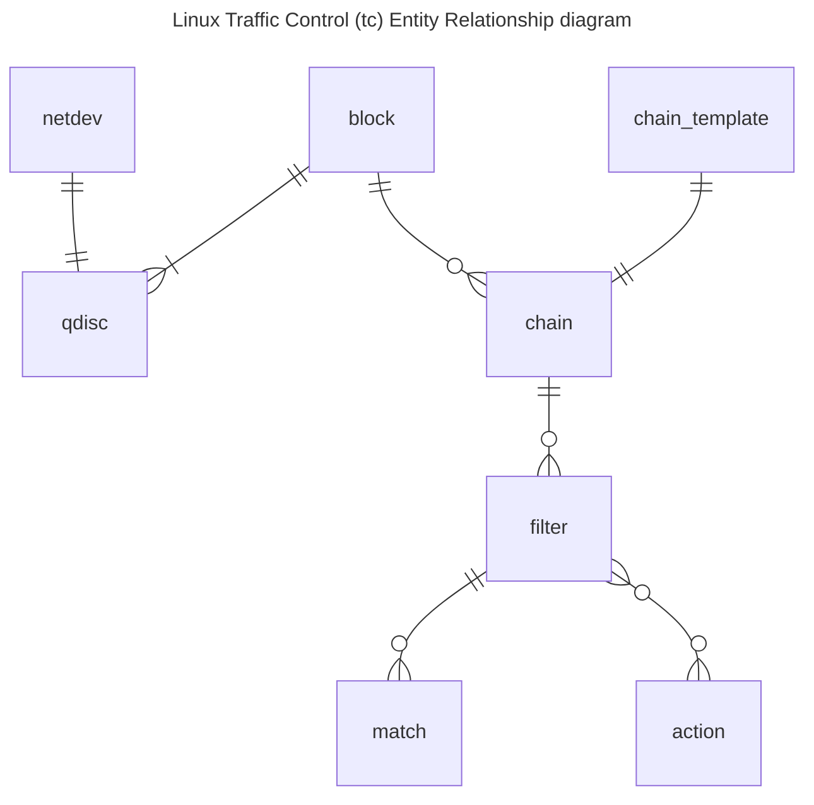
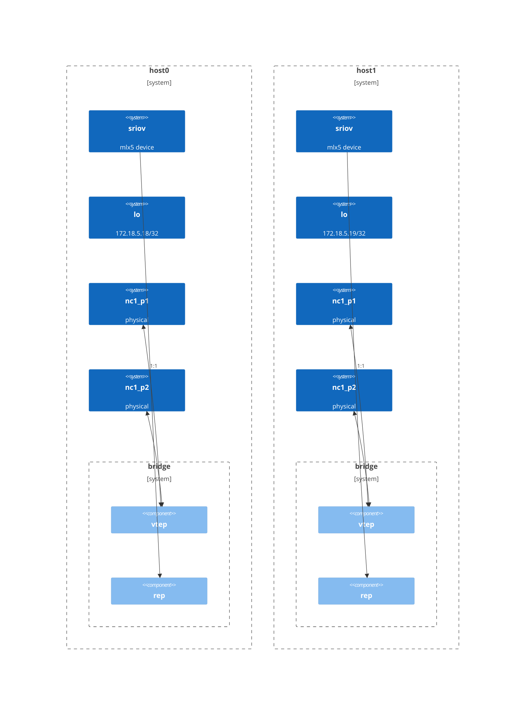

```mermaid
---
title: Linux Traffic Control (tc) Entity Relationship diagram
---
erDiagram
  netdev ||--|| qdisc : ""
  block ||--|{ qdisc : ""
  filter ||--o{ match  : ""
  filter }o--o{ action  : ""
  chain ||--o{ filter  : ""
  block ||--o{ chain  : ""
  chain_template ||--|| chain  : ""
```

```mermaid
C4Context
    Boundary(host0, "host0") {
        System(sriov0, "sriov", $descr="mlx5 device")
        System(lo0, "lo", $descr="172.18.5.18/32")
        Boundary(bridge0, "bridge") {
            Component(vtep0, "vtep")
            Component(rep0, "rep")
        }
        Rel(sriov0, rep0, "1:1")
        BiRel(vtep0, nc1p10, "")
        BiRel(vtep0, nc1p20, "")
        System(nc1p10, "nc1_p1", $descr="physical")
        System(nc1p20, "nc1_p2", $descr="physical")
    }

    Boundary(host1, "host1") {
        System(sriov1, "sriov", $descr="mlx5 device")
        System(lo1, "lo", $descr="172.18.5.19/32")
        Boundary(bridge1, "bridge") {
            Component(vtep1, "vtep")
            Component(rep1, "rep")
        }
        System(nc1p11, "nc1_p1", $descr="physical")
        System(nc1p21, "nc1_p2", $descr="physical")
        Rel(sriov1, rep1, "1:1")
        BiRel(vtep1, nc1p11, "")
        BiRel(vtep1, nc1p21, "")
    }
```

