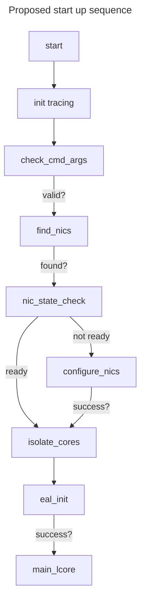
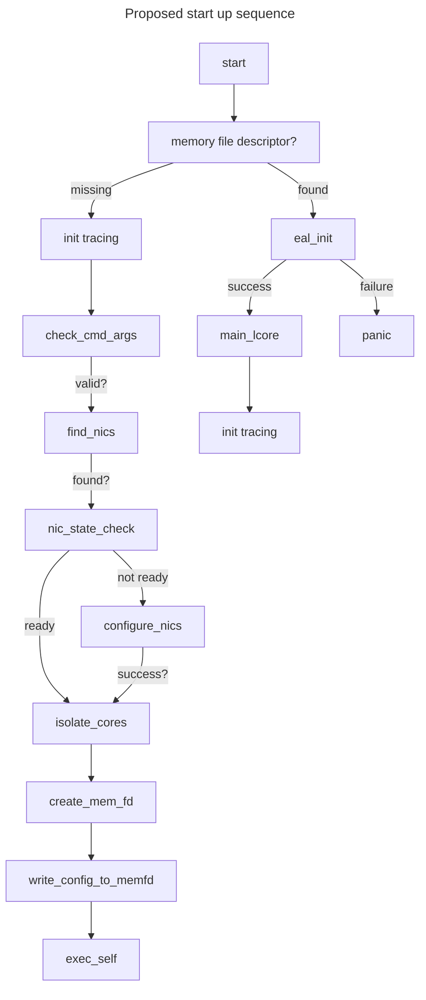

# DPDK + async rules

## Thread types

- main lcore
- EAL lcore
- service lcore
- Non EAL lcore
- external thread

## Main lcore

The main lcore has special powers in DPDK and some actions are restricted to
this thread.
In particular, the main lcore is the only lcore which can correctly manage the
other types of lcores and it is the only lcore which can properly shut down the
EAL.

The main lcore will start life with a fair amount of permissions, use them briefly,
and then drop them permanently.

**Avoid doing too much work here.**
This thread is special and is generally not suited for packet processing.

In particular, the main lcore should be expressly scheduled _outside_ of the
set of isolated processor cores.
It should never matter if this thread is preempted by the OS.

The main lcore likely could run tokio, but I don't think we need it to do so and
it may be best avoided.
Who knows what constraints DPDK will impose on us in the future?

## EAL lcore

These are your main worker cores.

- Lifetime managed by the main lcore.
- **EAL lcores are not dynamic!**
  You pick the number of worker lcores when you initialize the EAL and they are
  static for the lifetime of the EAL.
- Responsible for polling the NICs.
- Optionally responsible for packet processing.
- Should operate with limited permissions.
- **Constantly invokes functions which must not be preempted** (e.g. dpdk ring operations).

**I think we can and should run tokio (current thread only) but we must hard ban
some functionality and restrict other functions.**

Most importantly, you _can't_ preempt dpdk rings safely.
Almost everything in the DPDK uses dpdk rings aggressively, including

- packet enqueue,
- packet dequeue,
- and memory management.

## non-EAL lcore

These are

- largely the same as EAL lcores
  - somewhat more restricted (some functions require EAL lcores)
- need to be registered _and_ unregistered with the EAL
- can still allocate and deallocate DPDK memory

Unlike EAL lcores, they are

- dynamic
- manually scheduled to specific cores

## service lcore

This is largely out of scope here but we need to chat about it anyway.

[See here for details](https://doc.dpdk.org/guides-25.07/prog_guide/service_cores.html)

## independent thread

These are any thread which has not been manually registered with the EAL.

These _can not_ run most DPDK functions. They must never attempt to allocate or
de-allocate DPDK memory.

We should never allow the creation of these threads if at all possible.

The initial program thread should become the main lcore, and then we should
immediately register any other independently created threads with the EAL.

## Async concerns

### Banned in async

Basically anything which can preempt us at an arbitrary point in time:

- signal handlers (tokio or otherwise),
- **interrupt handlers** (these must be scheduled on a different kind of lcore),
- alarms (just never use these),
- keepalives (these need special attention and must be used on another lcore anyway).
- `rte_pause` and `rte_wait_until_equal_*`
- `rte_rcu_qsbr_synchronize`
- power monitoring operations (there are lots of exceptions to this rule tho)
  - frequency manipulation is ok
  - uncore manipulation should be fine
  - pmd power management looks ok

### Restricted in async

You can't hold any of these across await points:

- sequence counts
- any kind of special DPDK lock
  - sequence lock
  - ticket lock
  - phase lock
  - mcs lock
  - rw lock
  - qsbr locks
  - spin locks (especially)

### Possible exceptions to the bans

- `rte_pause` is quite safe in an async context, but it is likely better to yield.

- Sequence count may be technically safe across await points, but I consider
  holding a sequence count across await points to be very ill advised.
  The best case scenario is that you end up with an absurd number of retry operations.
  It will also likely be profoundly confusing.

## Unknowns

I do not know how tokio + DPDK will interact with quiescent state variables.
I think we can still use RCU / quiescent state variables if needed but they will
need special attention with async.

It may be possible to do cute tricks with scheduling by putting quiescent state
variables in an async mutex (this is likely a very bad idea tho).

I recommend we avoid QS variables unless we truly need them, and even then it will
require careful design.

## Proposed design

DPDK global allocator friendly startup sequence (looks more complex but is much
easier IMO).

## Special concerns

### Link state

Link state is signaled to the OS via netlink and to DPDK via interrupt.

DPDK rings must not be preempted so this is handled by a dedicated DPDK thread.

Getting link state info back to the main / worker threads can be done in many ways.
We just need to pick one:

- Using an atomic bool which we check once per batch (this is my favorite option).
- Using an async watch queue
- Using a left right (seems a little silly)

You must ack the interrupt to reset the handler.
This ack step should be done in the drop trait of a wrapper type.

### Interrupt mode vs poll mode

DPDK nics can work in poll mode or interrupt mode.

Interrupt handling is generally managed by a dpdk event dev and may not need
special handling in tokio, but I can't confirm that without research we
likely don't have time for.

**Do you agree / acknowledge the risk that we may need a significant refactor to
support interrupt mode later if we skip that research?**

I think the risk must be fairly low; dpdk rings can't be preempted but the
event dev is managed by dpdk rings.
I suspect this is implemented by a dedicated thread which doesn't ack the
interrupt until after it has bulk enqueued the packets to the ring.
The interrupt should not fire again until after the ack so that seems safe.

## Current state

## Completed or very nearly completed tasks

Some of this is from before you started, so I should show you what's going
on in the DPDK framework we currently have.

- can init the EAL
- can init worker threads
- can register non-EAL worker threads
- can shut down worker threads (this is sometimes kinda rocky)
- can poll nic rx queues
- can push to nic tx queues
  different levels of maturity)
- dpdk memory allocator works but needs small modifications
- can create and destroy tap devices
- can get packets off of tap devices
- can put packets on to tap devices

> [!NOTE]
> These abilities currently only work for nics with bifurcated drivers.
> We need to add nic driver bind / unbind to make the work for virtio NICs (and
> most other nic types)

## Tasks in flight / researched

- PCIe bus:
  - from outside DPDK
  - for nics bound to a linux driver
  - for nics unbound from a linux driver
  - determine which NUMA node a NIC is on
- CPU / memory topology
  - can get SMT / cache / NUMA topology

## Immediate term tasks

- Basic data collection:
  - (PR#1.0) CPU / PCIe bus walk data structure definition
  - (PR#1.1) fill out that data structure
- NIC driver bind / unbind
  - (PR#2.0) unbind nics from kernel (vfio mode) (tests will run in vm runner)
  - (PR#2.1) re-bind nics to kernel (kernel mode) (tests will run in vm runner)
  - (PR#2.2) NIC bind / rebind tests in CI
  - (PR#2.3) NIC bind / rebind tests in VLAB
- DPDK nic probe (now that the nic is detached from linux, we need to)
  - (PR#3.0) DPDK nic probe (get it into the EAL)
  - (PR#3.1) RX/TX (one queue per thread)
  - (PR#3.2) (optional) queue tear down (should be easy)
  - (PR#3.3) (optional) EAL shutdown (might be tricky)
- (PR#4) Combine thread frameworks with kernel driver
  - if the thread framework is not compatible then the kernel driver will quickly
    become useless.
  - There is no reason to combine the thread frameworks early because that just
    assumes we know all our constraints before we start.
  - Basically, this will likely involve imposing the DPDK thread structure / async
    constraints on the kernel driver even if they are unnecessary for the kernel
    driver.
  - Ideally, most of our constraints can be captured as types. "Be careful" is
    a bad design philosophy and hope is not a strategy.
- (PR#5) modify process initialization flow to use
